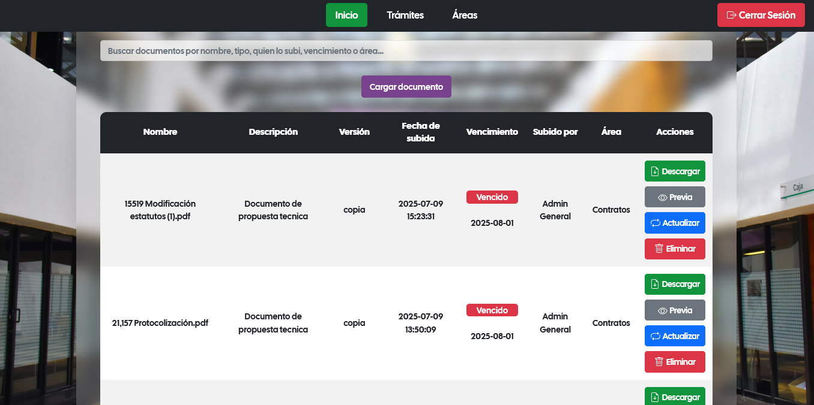
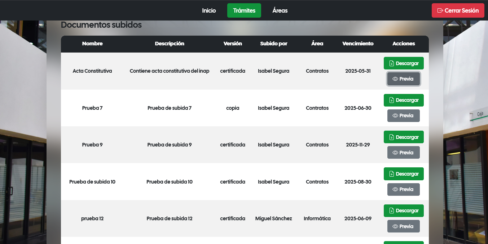
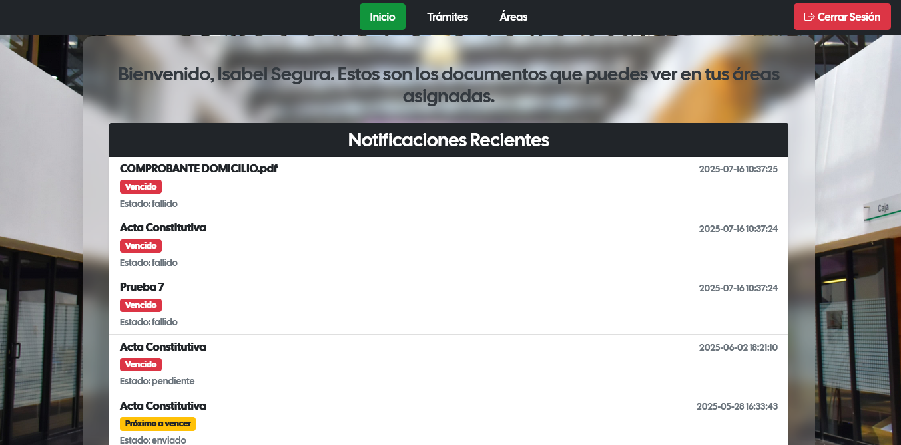

# Gestor de archivos 

Sistema web tipo CRUD para gestión de archivos

## Tecnologías utilizadas 

-PHP
-MySQL
-JavaScript
-HTML/CSS
-Bootstrap

## Funcionalidades 
-Gestión de archivos 
-Carga y descarga de documentos
-Administración de usuarios
-Organización de información
-Envio de notificaciones 

## Capturas del sistema

### Captura del login

### Captura del dashboard desde las sesión de adminstrador

### Captura del dasboard del usuario

### Cpatura del panel de notificaciones

